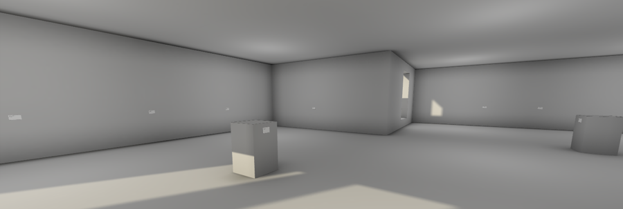

# *The Stolen Art Gallery*

# [Play Online](https://www.pippinbarr.com/the-stolen-art-gallery/webgl/) or Download for [Mac](https://github.com/pippinbarr/the-stolen-art-gallery/releases/tag/mac) or [Windows](https://github.com/pippinbarr/the-stolen-art-gallery/releases/tag/windows)

## Description
*The decrepit chestnut strikes back! Games! Art! It’s an art gallery so it’s art! But there’s no art in it so it isn’t! But maybe that’s art so it is! But it’s a videogame so it isn’t’! But everything is different now so it is!*

The Stolen Art Gallery was inspired by [Ziv Schneider](http://www.zivschneider.com/)&#8216;s [The Museum of Stolen Art](http://zivschneider.com/The-Museum-of-Stolen-Art). The modelling was done in [SketchUp](http://www.sketchup.com/) and the game is constructed in [Unity 5](http://unity3d.com/) and uses [First Person Drifter](http://torahhorse.com/first-person-drifter-controller-for-unity3d) by [Ben Esposito](http://torahhorse.com/). The art in the gallery is drawn from the [Federal Bureau of Investigation&#8217;s National Stolen Art File](http://www.fbi.gov/about-us/investigate/vc_majorthefts/arttheft/NSAF).

## Documentation
* Read the [Process Documentation](../process)
* Look at the [Code Repository](https://github.com/pippinbarr/the-stolen-art-gallery) for source code etc.

## Press
* [Kill Screen](http://killscreendaily.com/articles/pippin-barr-virtual-art-gallery-contains-no-art-but-lots-questions/)
* [Warp Door](http://wip.warpdoor.com/2015/05/15/the-stolen-art-gallery-pippin-barr/)

## License
*The Stolen Art Gallery* is licensed under a [Creative Commons Attribution-NonCommercial 3.0 Unported License](http://creativecommons.org/licenses/by-nc/3.0/).
