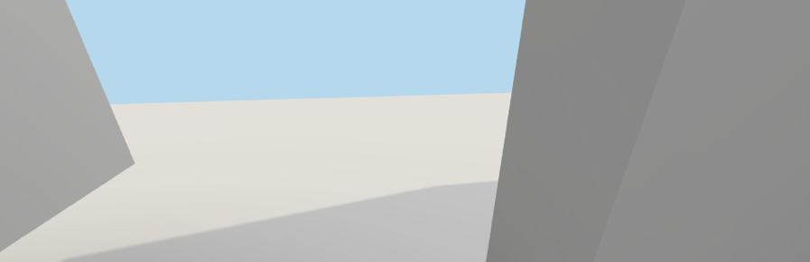
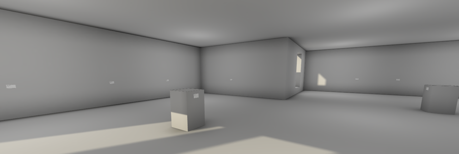

# Blog Posts

Here are public-facing blog posts I wrote about the game.

## Oh Brave New Dimension, That Has Such Lighting In It (2015-05-09)

Along with failing to write blog posts this week or so I've been building my first Unity project, The Stolen Art Gallery. The general idea was to choose something really simple that I could maybe handle as a first go at 3D, so I went with: a room with some stuff in it. Doesn't get much more simple than that, right?

Well.

In fact just making that room was quite a lot of effort for me. Stepping into the third dimension has been a strange experience. I'm not quite up to writing something coherent about it, though, so here are some quotes from my ongoing development notes while I made the game, skewed toward "life with 3D".

> "Just a small dealer gallery in Unity with labels indicated stolen artworks on the walls and that’s about it."
>
> "General rookie architecture stuff which has been really quite satisfying. So I’m happy with how it’s going. It’s conceivable I could finish it tomorrow"
>
> "I had to tint the labels greenish blue in order to be able to see them on the walls because of the behaviour of light in the world and specifically the concept of materials. That is, because the labels were the same as the wall (white “material”) they lit in exactly the same way and thus were exactly the same colour. The things we take for granted in day to day life, that things are of different materials and so reflect light in different ways (even if they’re the same “colour”). The literal-mindedness of a computer is so weird here… it’s both “fair” and insane to have to think about things like this."
>
> "Oh my GOD I am annoyed with this game by now. Having huge difficulties in lighting the scene to be legible and not a complete and utter mess. It looks like I might have to slowly rebuild everything from scratch."
>
> "Now it’s the next morning and I MIGHT have got a working version by restarting the entire process? I’m not clear on what has changed though and it feels tenuous, like the whole thing could just collapse at a moment’s notice."
>
> "It’s surreal how some things that should be hard are easy: I can raise a wall in a moment, I can spin the world on its axis, examine it from afar or up close, install a pane of glass instantly, “wire up lights” with a click, etc. But then things that should be easy are hard: finding a decent bulb for those lights, getting it to cast light "nicely", getting my art labels to stick to the wall, knowing in advance what colour those walls are going to be."
>
> "Just had a problem where I was constantly getting weird fucking shadows. After much fiddling it turned out that if I rotated the specific label object it kind of fixed it? It only affected a select few of the labels and seemed to correspond to when I’d been rotating the labels around the gallery. But I did that in SketchUp. Weird. Then I changed some lighting stuff and it went haywire yet again (on every label) which I then “fixed” with a more high quality bake? I don’t really get it. Maybe I’ll understand light a bit more next time."

Maybe I'll understand light a bit more next time. Yeah, **maybe**.

## But Is It Stolen Art? (2015-05-12)

(I'm still really struggling to get my head back into the writing-game at the moment, but here's another throw of the dice.)

The Stolen Art Gallery will be out in roughly a day so I thought I should attempt to write a little more about it here so that there are some of my own words on the matter on the internet. Here I thought I would mostly address the general ideas of find interesting about it as a project.

So, I made The Stolen Art Gallery as a direct reaction to hearing about (and seeing the promotional video for) [The Museum of Stolen Art by Ziv Schneider](http://zivschneider.com/The-Museum-of-Stolen-Art). Schneider's project is quite interesting &#8211; it's a virtual space in which you can go and see artworks that have been stolen as images rendered into a 3D museum. The stated purpose is to make these works accessible and even to assist in the locating of these works by raising awareness. It's quite a noble idea and I'm supportive of it. But my other reaction was, perhaps unsurprisingly, a desire to subvert or almost "correct" the idea of displaying stolen art. So I wanted to make a version in which you can go to a virtual space that presents stolen art, but the art isn't there &#8211; because it's been stolen. Hence The Stolen Art Gallery (a smaller and more manageable space).

The main thing I like about this is that The Stolen Art Gallery exists as this "accessible" place to see this stolen art and, like the Museum of Stolen Art, could "show you" the images of the stolen art, but then declines to do so. I think that's amusing, of course, but I think it's also fun and interesting to think about this whole idea of the internet's purpose being to make every accessible and, in particular, the idea that if I show you a JPEG of a stolen artwork I'm somehow showing you the artwork itself or even a remote "version" of it. So in a way I end up feeling like The Stolen Art Gallery has an honesty to it &#8211; what these stolen artworks look like, for us, is "nothing" &#8211; because we can't see them, and their absence is something that speaks more powerfully, in some ways, than an image of them could.

Along with that sort of philosophical bent on technology and access, I was of course very interesting in creating a manageable 3D space in Unity, which isn't something I've ever done before. In particular I like the idea of creating 3D spaces that don't have a kind of entertainment-utility beyond the actual space (and contents). That is, it's not what you "do" in The Stolen Art Gallery that's meant to be interesting (beyond perceiving the space) &#8211; it's not that you rocket-jump through the windows or trigger a question in front of a plinth, etc. So there's also this idea of returning 3D space to being just that: a space that you can be in and that's that.

So that's a few words on The Stolen Art Gallery from its fatigued architect anyway. Night.
